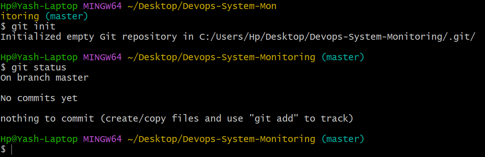
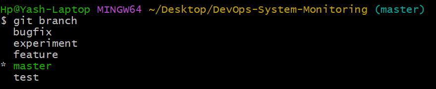
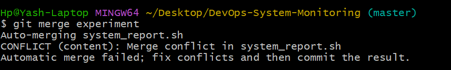
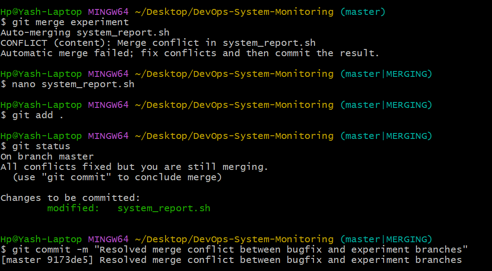
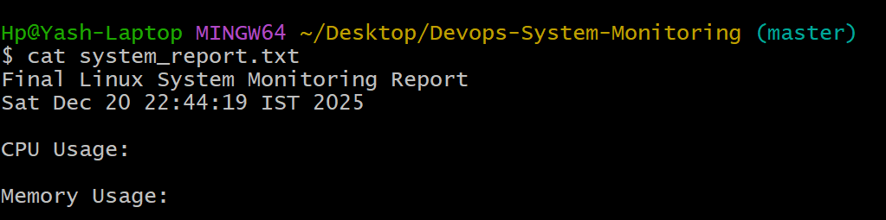

# DevOps-Based Automated System Monitoring Script  
### Git Bash & GitHub Hands-On Project

**Developed by: Yash Singhal**

---

## 📌 Introduction
This project is developed as part of the **Fundamentals of DevOps** course to demonstrate the practical usage of **Git Bash and GitHub** along with basic **Linux automation**.  
The project focuses on applying version control concepts such as repository creation, branching, merging, and conflict resolution, along with automating system monitoring tasks using a shell script.

---

## 🎯 Project Objectives
- To automate basic system monitoring using Linux shell scripting  
- To understand and apply Git version control concepts  
- To perform branching and merging operations  
- To demonstrate merge conflict creation and resolution  
- To use GitHub as a remote repository  
- To document the complete DevOps workflow using Markdown  

---

## 🛠 Tools & Technologies Used
- Git & Git Bash  
- GitHub  
- Linux Shell Scripting  
- Markdown (`README.md`)  

---

## 📂 Project Description
The project consists of a shell script named `system_report.sh` that automatically generates a system monitoring report.  
The report includes:
- Date and time  
- CPU usage  
- Memory usage  

The generated output is saved in a file named `system_report.txt`.  
All development activities are tracked using Git with multiple branches and meaningful commits.

---

## ⚠ Challenges Faced
- Understanding Git workflow and staging area
- Managing multiple branches
- Resolving merge conflicts
- Running Linux commands on Windows Git Bash

---

## 🛠 How Challenges Were Overcome
- Practiced Git commands regularly
- Verified active branch before editing
- Manually resolved merge conflicts
- Used Ubuntu (WSL) for Linux command execution

---

## 🌿 Git Workflow Implemented
The following Git concepts were implemented in this project:

- Repository initialization using `git init`
- Minimum **10 meaningful commits**
- Creation of **four branches**:
  - feature  
  - test  
  - bugfix  
  - experiment  
- Merging branches into the main branch
- Intentional creation of a merge conflict
- Manual resolution of merge conflict
- Final project push to GitHub

---

## 💻 Git Commands Used
- `git init`  
- `git status`  
- `git add`  
- `git commit`  
- `git branch`  
- `git checkout`  
- `git merge`  
- `git log`  
- `git remote add origin`  
- `git push`  

---

## ⚙ Automation Execution
The automation script is executed using the following command:

---

## 🖼 Screenshots (With Description)

| Screenshot | Description |
|----------|------------|
|  | Git repository initialization |
|  | Branch creation and listing |
|  | Merge conflict demonstration |
|  | Conflict resolution |
|  | Automation script execution |

---

## Conclusion
This project demonstrates practical usage of Git and GitHub along with Linux automation.
It strengthened understanding of version control systems, branching, merging, and documentation.

---

## 👤 Author
**Yash Singhal**  
DevOps & Computer Science Student

---

```bash
bash system_report.sh
