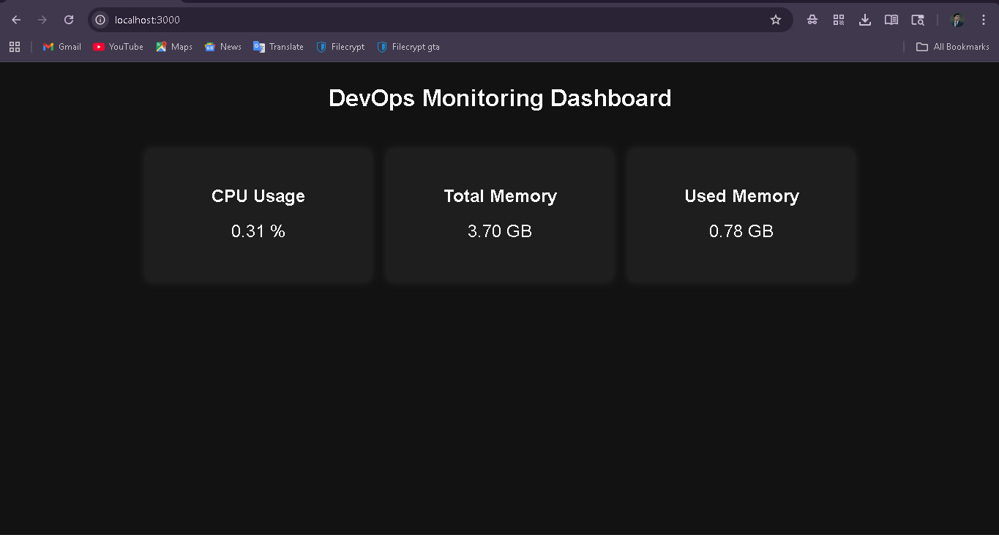
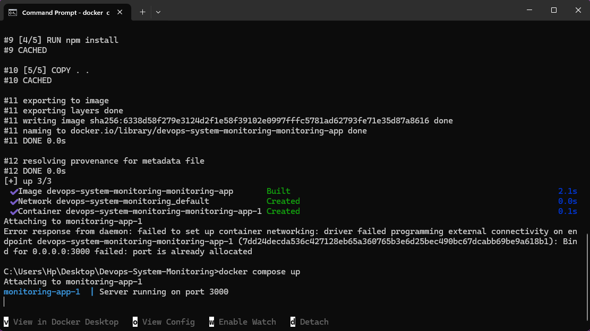
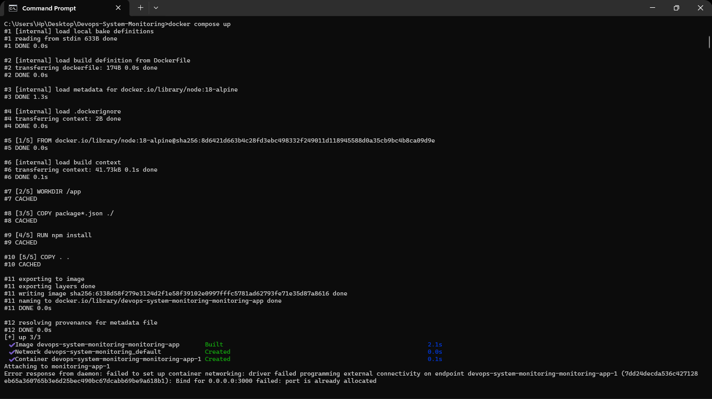
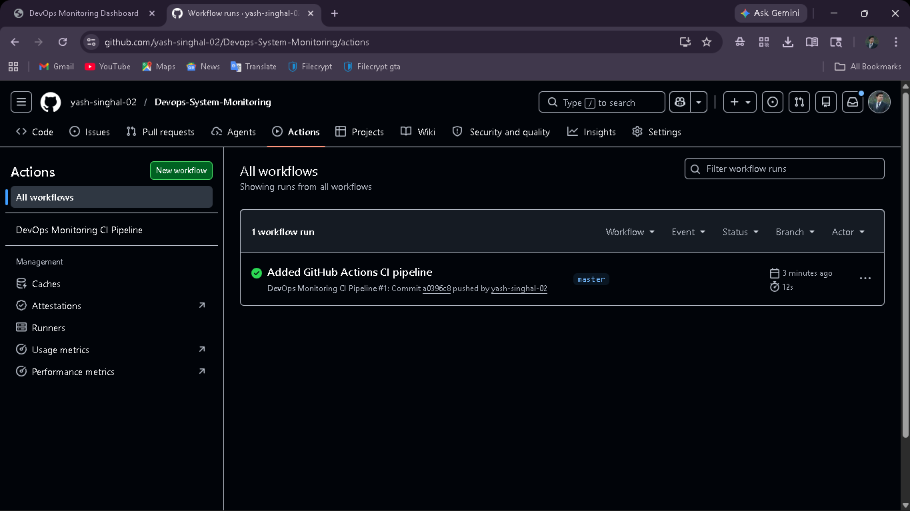

# DevOps Infrastructure Monitoring System

### Dockerized Monitoring Dashboard with CI/CD Automation

**Developed By: Yash Singhal**

---

# Introduction

This project is developed as part of the **DEVOPS VIRTUALIZATION AND CONFIGURATION MANAGEMENT** course to demonstrate practical implementation of modern DevOps concepts including:

- Containerization
- CI/CD Automation
- Docker Orchestration
- Infrastructure Monitoring
- Version Control

The project provides a real-time monitoring dashboard that displays important system metrics such as CPU usage and memory utilization through a centralized web interface.

The application is containerized using Docker, managed using Docker Compose, and automated using GitHub Actions CI/CD pipeline.

---

# Project Objectives

- To develop a real-time infrastructure monitoring dashboard
- To monitor CPU and memory usage
- To implement Docker containerization
- To manage services using Docker Compose
- To automate Docker builds using GitHub Actions
- To understand practical DevOps workflow implementation
- To integrate Git and GitHub version control

---

# Tools & Technologies Used

| Tool / Technology | Purpose |
|---|---|
| HTML | Frontend structure |
| CSS | Dashboard styling |
| JavaScript | Frontend functionality |
| Node.js | Backend server |
| Express.js | API development |
| Docker | Containerization |
| Docker Compose | Multi-container orchestration |
| Git & GitHub | Version control |
| GitHub Actions | CI/CD automation |
| Linux Commands | System monitoring |

---

# Project Description

The project consists of a monitoring dashboard that fetches real-time system information using backend APIs.

The dashboard displays:

- CPU Usage
- Total Memory
- Used Memory

The backend is developed using Node.js and Express.js. System information is collected using the `systeminformation` package.

The complete application is containerized using Docker and deployed using Docker Compose.

A GitHub Actions CI/CD pipeline is implemented to automatically build the Docker image whenever code is pushed to the GitHub repository.

---

# Features

 Real-time monitoring dashboard  
 CPU usage monitoring  
 RAM usage monitoring  
 Docker containerization  
 Docker Compose orchestration  
 Automated CI/CD pipeline  
 GitHub integration  
 Responsive dashboard UI  

---

# Project Folder Structure

```text
Devops-System-Monitoring/
│
├── backend/
│     ├── public/
│     │      ├── index.html
│     │      ├── style.css
│     │      └── script.js
│     │
│     ├── server.js
│     ├── package.json
│     ├── Dockerfile
│     └── node_modules/
│
├── screenshots/
│
├── docker-compose.yml
├── README.md
├── system_report.sh
├── system_report.txt
│
└── .github/
      └── workflows/
            └── main.yml
```

---

# Docker Implementation

## Build Docker Image

```bash
docker build -t devops-monitor ./backend
```

---

## Run Docker Container

```bash
docker run -p 3000:3000 devops-monitor
```

---

# Docker Compose Implementation

## Run Project Using Docker Compose

```bash
docker compose up
```

Docker Compose automatically:
- Builds the application
- Creates containers
- Maps ports
- Runs monitoring service

---

# GitHub Actions CI/CD

This project uses GitHub Actions for Continuous Integration and Continuous Deployment (CI/CD).

Whenever code is pushed to GitHub:

- GitHub Actions automatically triggers
- Docker image is automatically built
- CI/CD pipeline executes successfully

---

# CI/CD Workflow

```text
Developer Pushes Code
          ↓
GitHub Repository
          ↓
GitHub Actions Triggered
          ↓
Docker Image Build
          ↓
CI/CD Pipeline Execution
          ↓
Deployment Ready
```

---

# Git Workflow Implemented

The following Git concepts were implemented:

- Repository initialization using `git init`
- Multiple commits
- Branch creation and management
- GitHub repository integration
- Docker project version tracking
- Push and pull operations
- CI/CD workflow integration

---

# Git Commands Used

- `git init`
- `git status`
- `git add`
- `git commit`
- `git pull`
- `git push`
- `git branch`
- `git merge`
- `git log`

---

# Challenges Faced

- Understanding Docker containerization
- Managing Docker port conflicts
- Configuring Docker Compose
- Setting up GitHub Actions CI/CD
- Handling Git merge conflicts
- Managing Docker image build issues

---

# How Challenges Were Overcome

- Restarted Docker Desktop during build issues
- Used lightweight Docker images (`node:18-alpine`)
- Cleared Docker cache and unused images
- Properly mapped ports using Docker Compose
- Practiced Git commands and merge handling
- Verified CI/CD pipeline execution through GitHub Actions

---

# Screenshots

## Dashboard Running



---

## Docker Image Build



---

## Docker Compose Execution



---

## GitHub Actions CI/CD



---

# Expected Outcome

- Successful Dockerized monitoring dashboard
- Real-time system monitoring
- Working Docker Compose orchestration
- Automated CI/CD implementation
- Improved understanding of DevOps workflow
- Practical implementation of containerization

---

# Future Scope

- Jenkins Integration
- Kubernetes Deployment
- Advanced Monitoring Graphs
- Cloud Deployment
- Email Alerts & Notifications
- User Authentication System

---

# Conclusion

This project successfully demonstrates practical implementation of modern DevOps concepts using Docker, Docker Compose, GitHub, and GitHub Actions.

The project provides hands-on experience with:
- Containerization
- Infrastructure Monitoring
- CI/CD Automation
- Deployment Workflow
- Version Control

It enhanced practical understanding of DevOps lifecycle management and modern deployment practices.

---

# Author

### Yash Singhal

DevOps Infrastructure Monitoring System Project

---

# 📄 License

This project is developed for educational purposes.
